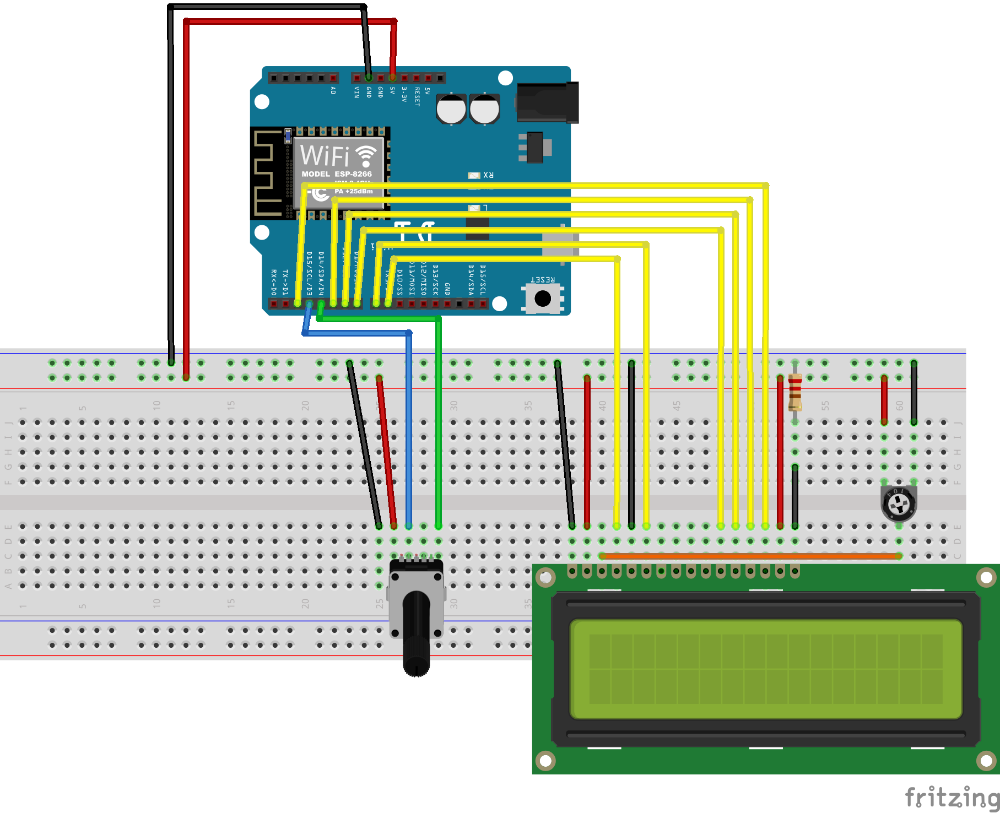

# BrokerBot
A bot player and game logistics manager for 3M's 1964 classic [Stocks & Bonds](https://boardgamegeek.com/boardgame/1590/stocks-bonds).

## Directory Guide
- **BrokerBotCloud**: Flask app to be run on an AWS instance
  - Run `python app.py` to start it
- **MasterBoard**: Code to be uploaded to Arduino board
- **project_assets**: Documentation/odds and ends for project grading

## Code Requirements
Arduino code has the following dependencies:
- `ArduinoJson`: obtainable through library manager
- ESP8266 Boards: follow [this tutorial](https://randomnerdtutorials.com/how-to-install-esp8266-board-arduino-ide/)

Additionally, you will need to have `connection.h` visible to Arduino, which contains internet credentials:
```c
// Your WiFi's name
#define WIFI_NAME "Name"

// Your WiFi's passowrd
#define WIFI_PSWD "Password"

// Address to make HTTP requests to
#define GAMESERVER_IP "http://<some ip>/stocks"
```
This file could be in this repository or in another directory where Arduino can find it. Don't upload your internet credentials to GitHub!

## Wiring Diagram

NOTE: I couldn't find a Fritzing part for the encoder, but I used a KY-040 rotary encoder, which has 5 pins. Due to pin limitations on the Arduino board, the DT (direction) pin on the encoder is unused.

## BrokerBot's Strategy
Currently, the bot uses a simple "buy low, sell high" strategy: each turn, it sells the stocks which made over a certain threshold of money since they were purchased, and then buys the cheapest stock available. Initial portfolio is randomly selected. Areas in the code which control BrokerBot's strategy and not game rules are marked with a `//STRATEGY` comment.

## Not Yet Implemented
Cool features I'd like to add at some point!
- Add some kind of HTTP authentication
- Use the [Google Charts API](https://developers.google.com/chart/interactive/docs/gallery/linechart) to generate a running graph of the stock prices during the game [(Example)](https://jsfiddle.net/6va5r8yq/5/)
- A way for multiple BrokerBots to play at a time
- A way for multiple games to be played at a time
- A less awkward input method than the encoder
